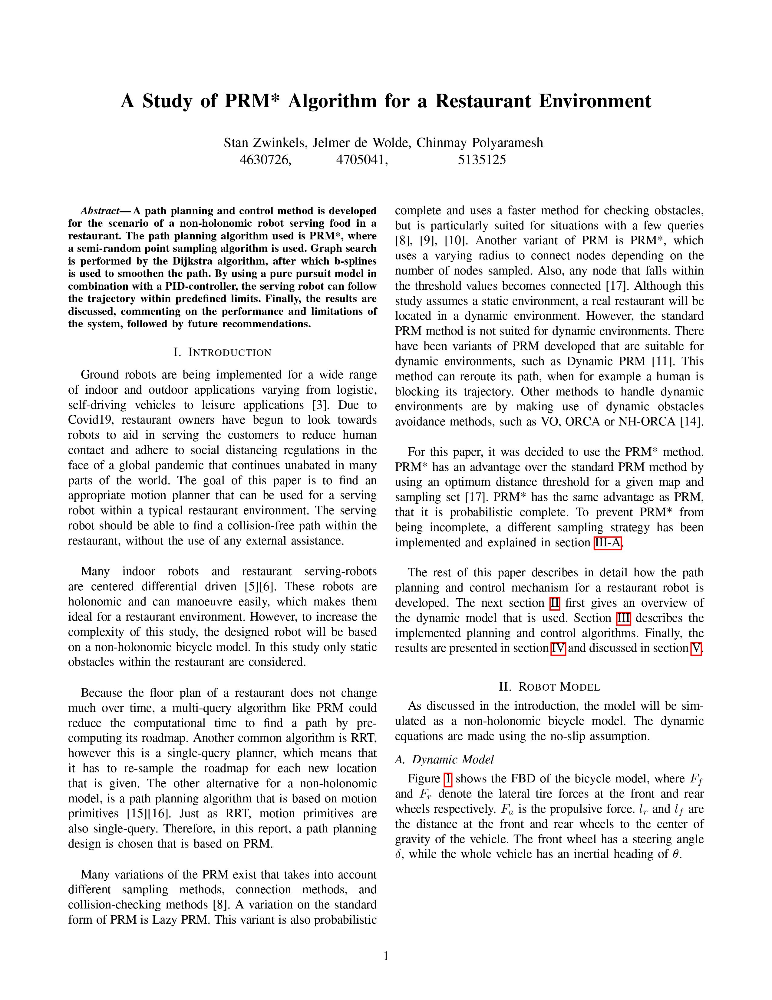
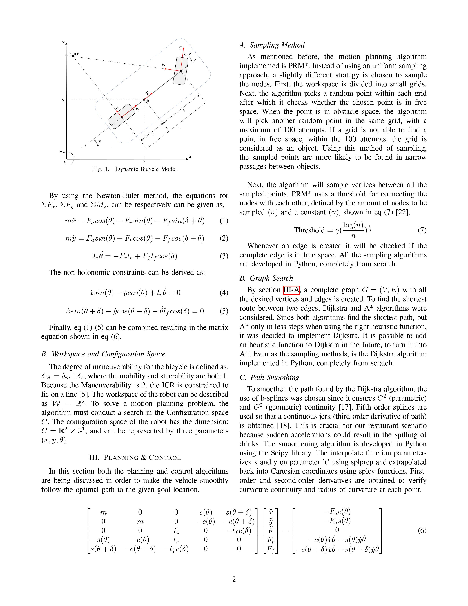
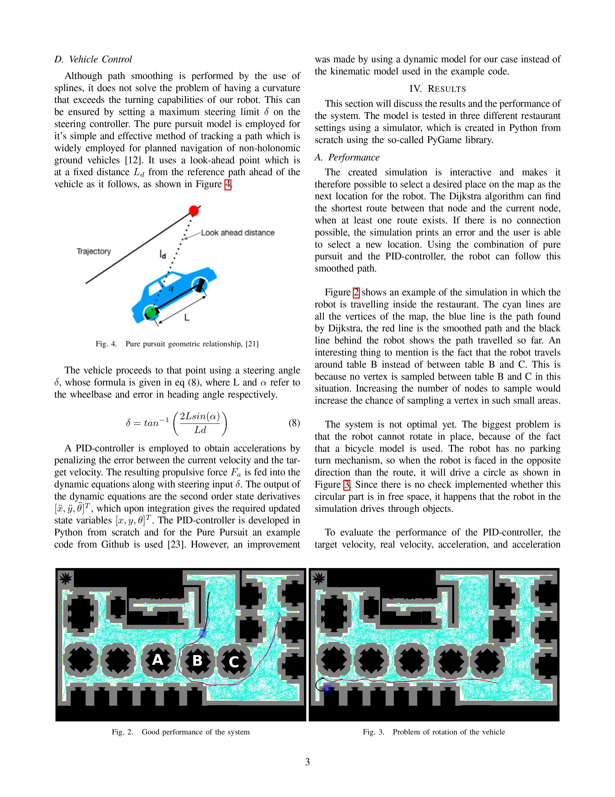
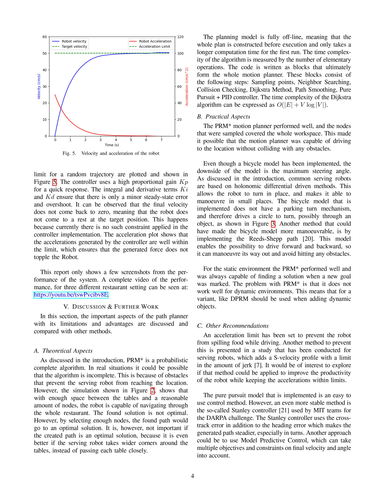

# robot_waiter

A path planning and control method is developed for the scenario of a non-holonomic robot serving 
food in a restaurant. Take a look at [video](video.mp4) for a quick summary. Read the [report](report.pdf) 
provided for a detailed explanation of mathematics behind the code.
 
## Contributers
1. Chinmay Polyaramesh		5135125
2. Stan Zwinkels		4630726
3. Jelmer de Wolde		4705041

## Install packages
math \
numpy \
scipy \
PIL \
random
 \
os \
pygame

## Usage

Run the scipt `Main.py`. A PyGame windows will be opened. 
First run always takes a while, since borders 
are
 getting plotted and graph gets sampled. The location can be selected using mouse click. Map can be 
changed on line 32. Three maps are supplied (A, B and C).

### Explanation

